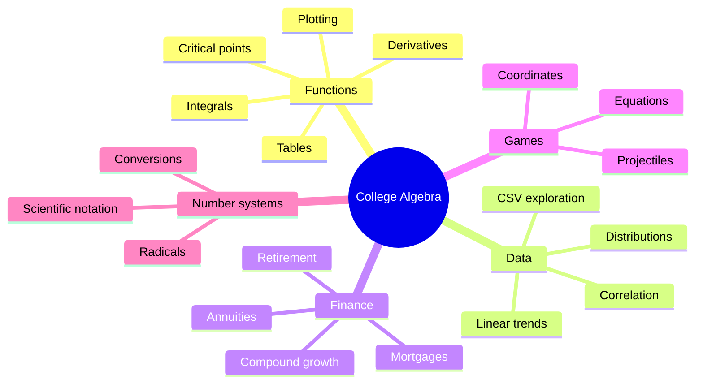

<div align="center">

<sub>Real photography by <a href="https://unsplash.com/photos/focused-student-studying-at-a-library-table-with-a-laptop-NASjMHJ9OhI">Ashutosh Gupta on Unsplash</a>.</sub>

# College Algebra Certification Projects
### Five interactive applications that turn algebra into games, analysis, finance, and visual exploration.


[Projects](#project-suite) · [Coverage](#mathematical-coverage) · [Setup](#quick-start) · [Engineering](#engineering-notes)
</div>

---

## Overview

This repository is a hands-on college-algebra portfolio rather than a single calculator. It combines a three-mode Pygame arcade, an exploratory data-analysis CLI, a precision-minded finance calculator, a large Flask/SymPy graphing workspace, and a multi-function number/algebra utility.

## Project suite

| Application | Interface | What it implements |
|---|---|---|
| `3mathgames.py` | Pygame | Scatter-plot targeting, algebra challenges, and projectile-motion gameplay with buttons/sliders |
| `datagraphExplorer.py` | CLI + Matplotlib | CSV from file/URL, schema exploration, scatter/line/hist/bar plots, correlation and linear trends |
| `FinCalc.py` | CLI | Annuities, mortgages, retirement growth, doubling time, logarithms, and scientific notation |
| `graphing_calc.py` | Flask web app | Multi-function plotting, quadratic solving, symbolic analysis, tables, CSV export, and result logs |
| `multiFuncCalc.py` | CLI class | Algebraic and number-format utilities collected behind a menu-driven calculator |

## Mathematical coverage



## Quick start

```bash
git clone https://github.com/TanishC4444/CollegeAlgebraCertProjs.git
cd CollegeAlgebraCertProjs
python -m venv .venv
source .venv/bin/activate
python -m pip install pygame numpy pandas matplotlib scipy requests flask sympy
```

Launch an individual experience:

```bash
python 3mathgames.py
python datagraphExplorer.py
python FinCalc.py
python graphing_calc.py      # open the Flask URL it prints
python multiFuncCalc.py
```

## Graphing workspace

The largest component exposes JSON routes for adding/removing functions, generating interactive and Matplotlib plot data, solving quadratics, analyzing expressions, generating tables, exporting CSV, and retrieving/clearing a results log. SymPy provides symbolic manipulation while NumPy/Lambdify handle numeric sampling.

## Finance precision

`FinCalc.py` separates formulas into reusable functions and uses `Decimal` configuration for presentation-sensitive calculations. It covers ordinary/due annuities, continuous variants, growing contributions, mortgage payments, balance growth, Rule-of-72-style doubling analysis, and notation conversion.

## Repository map

```text
CollegeAlgebraCertProjs/
├── 3mathgames.py
├── datagraphExplorer.py
├── FinCalc.py
├── graphing_calc.py
├── multiFuncCalc.py
├── templates/index.html
└── function_table.csv
```

## Engineering notes

- Independent apps make the learning objectives easy to run and review.
- Input-validation helpers in the finance tool centralize common CLI failure cases.
- The graphing app's symbolic evaluation surface requires careful expression validation before public deployment.
- There is no dependency manifest or automated test suite; each UI currently needs representative manual validation.
- A single shared environment is convenient but installs more packages than each individual project needs.

## Skills demonstrated

Object-oriented game UI · numerical computing · symbolic mathematics · Flask API design · data visualization · statistical interpretation · financial formulas · input validation · educational UX

## Resume-ready highlight

> Developed a five-application Python mathematics suite spanning Pygame learning experiences, statistical CSV exploration, financial modeling, symbolic/numeric function analysis, and a multi-route Flask graphing interface.

## License

No license file is currently included.

